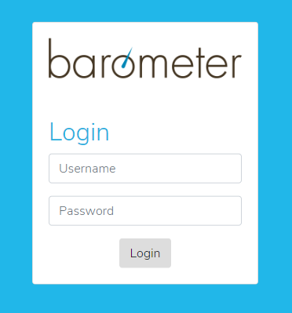
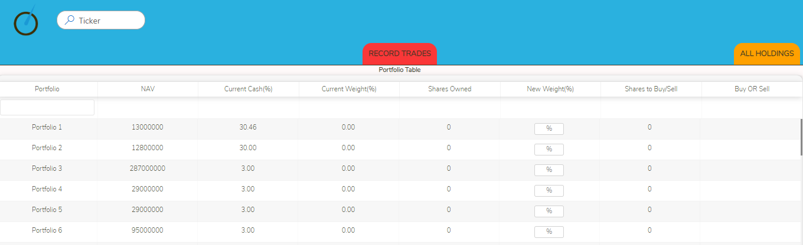
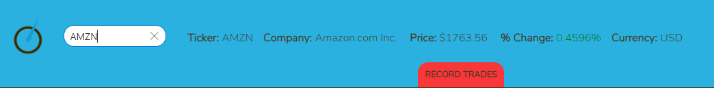
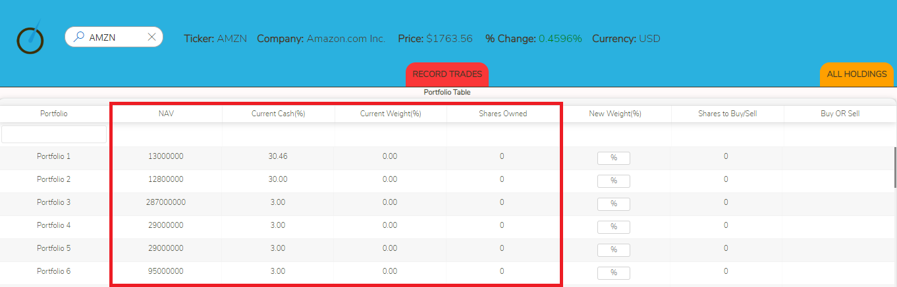
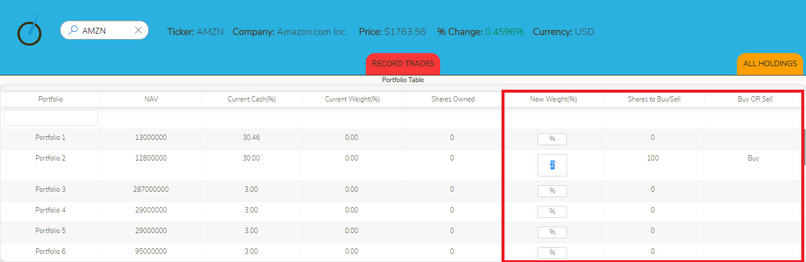
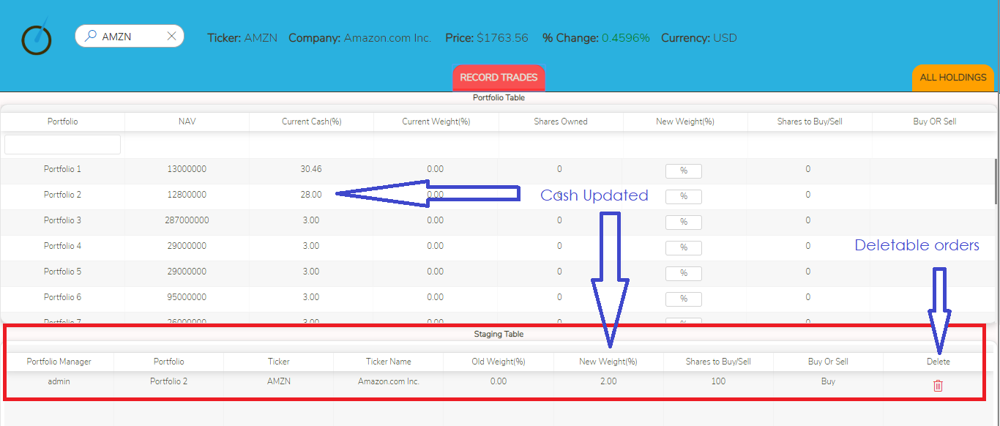
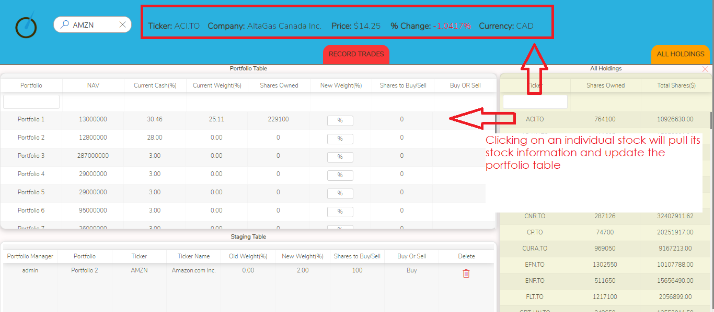

# Order Management System for Asset Managers

This app is a portfolio management system created by University of Toronto SCS coding bootcamp students for Barometer Capital Management

## Table of Contents

* [How it Works](#how-it-works)
* [Technologies](#technologies)
* [Copyright Information](#copyright-information)

## How it Works

- Uses a secure login as provided by administrators.

- Upon logging in, the below is seen on the screen

- Enter any ticker into the search field at the top (eg. AMZN or RY.TO). This will call to the Alpha Vantage API and returns information on the company and key data metrics, such as price and percent change in the price from the previous day

- The portfolios table show the net value of assets in each portfolio in the NAV column. 
    * The current cash column shows the total cash as a percentage of the NAV. 
    * The current weight shows the value of the shares owned, if any, as a percentage of the NAV.
    * Shares owned will show the number of shares owned of the ticker searched in the portfolio, if any

- The new weight input is based on a percentage of the NAV. When input, it will automatically calculate and show how many shares to buy or sell based on the new weight that's input. It will also show the direction of the trade, if it's a buy or a sell.

- Clicking on the record trade button will send the trade's to the order staging table at the bottom. This will accept and render individual rows for orders placed in multiple portfolios at once for the same stock.
    * Upon staging, the portfolio table will update each portfolio's current cash precentage for which an order has been staged. For example, if a user records an order to buy 2% AMZN in a portfolio that doesn't have AMZN as one of its holdings, that portfolio's current cash available will decrease by 2%

- A user can also view the holdings of an individual portfolio in a toggling side table by clicking on that portfolio in the portfolio table. A user may also view all holdings in that toggling side table when clicking on the All Holdings button. The individual securites displayed in the holdings table are clickable and will send a call to the API for that stock's data, and will also refresh the portfolios table to display all holdings of that stock.

### Additional Notes
- All tables are sortable by clicking on the column heading
- The Porfolios table has a search filter input box that filters by portfolio name
- The toggling holdings table has a search filter input that that filters by individual stock

## Technologies

### Front End/UI

* React.js
* React-table
* Passport
* Fabric
* Lodash
* Bootstrap
* Google fonts

### Middleware/Back-End

* Node.js
* Axios
* Path
* fs
* Express
* Sequelize
* body-parser
* MySQL

### API

* [Alpha Vantage API](http://alphavantage.co)

## Copyright Information

This application and its design are copyright of Barometer Capital Management inc. 2018- 
Permission has been granted to [Dan Homoncik](http://barometercapital.ca), [Matthew Tai](https://matthewtai.github.io/), [William Zhu](https://william5656.github.io/), and [Alexander Hau](https://chestirito.github.io/) for application demonstration purposes only.